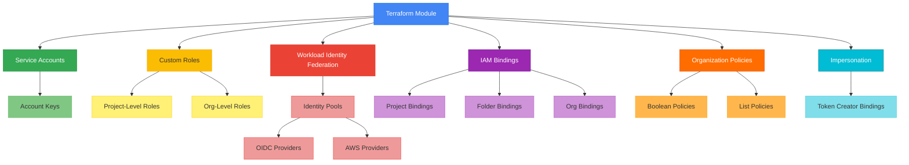

# terraform-gcp-iam

Production-ready Terraform module for managing Google Cloud IAM resources including service accounts, custom roles, workload identity federation, organization policies, and IAM bindings at project, folder, and organization levels.

## Architecture



## Usage

```hcl
module "iam" {
  source = "path/to/terraform-gcp-iam"

  project_id = "my-gcp-project"

  service_accounts = {
    "app-sa" = {
      display_name = "Application Service Account"
      description  = "Primary service account for the application"
    }
  }

  project_iam_bindings = {
    "app-viewer" = {
      role    = "roles/viewer"
      members = ["serviceAccount:app-sa@my-gcp-project.iam.gserviceaccount.com"]
    }
  }
}
```

## Features

- Service account creation and key management
- Project-level and organization-level custom IAM roles
- IAM bindings at project, folder, and organization scope with conditional access
- Workload Identity Federation with OIDC and AWS provider support
- Service account impersonation bindings
- Organization policy enforcement (boolean and list constraints)

## Requirements

| Name | Version |
|------|---------|
| terraform | >= 1.3.0 |
| google | >= 5.0 |
| google-beta | >= 5.0 |

## Inputs

| Name | Description | Type | Required |
|------|-------------|------|----------|
| project_id | GCP project ID | `string` | yes |
| service_accounts | Map of service accounts to create | `map(object)` | no |
| service_account_keys | Map of service account keys | `map(object)` | no |
| custom_roles | Project-level custom IAM roles | `map(object)` | no |
| org_custom_roles | Organization-level custom IAM roles | `map(object)` | no |
| project_iam_bindings | Project-level IAM member bindings | `map(object)` | no |
| folder_iam_bindings | Folder-level IAM member bindings | `map(object)` | no |
| org_iam_bindings | Organization-level IAM member bindings | `map(object)` | no |
| workload_identity_pools | Workload Identity Pools with providers | `map(object)` | no |
| service_account_impersonation | Impersonation bindings | `map(object)` | no |
| org_policies | Organization policy constraints | `map(object)` | no |

## Outputs

| Name | Description |
|------|-------------|
| service_account_emails | Map of service account IDs to emails |
| service_account_ids | Map of service account IDs to resource IDs |
| service_account_unique_ids | Map of service account IDs to numeric IDs |
| custom_role_ids | Map of custom role IDs to resource IDs |
| org_custom_role_ids | Map of org custom role IDs to resource IDs |
| workload_identity_pool_ids | Map of pool IDs to resource IDs |
| workload_identity_pool_provider_ids | Map of provider keys to resource IDs |
| project_number | The GCP project number |

## Examples

- [Basic](examples/basic/) - Simple service account and IAM binding
- [Advanced](examples/advanced/) - Custom roles, workload identity, impersonation
- [Complete](examples/complete/) - All features including org policies and multi-level bindings

## License

MIT License - see [LICENSE](LICENSE) for details.
